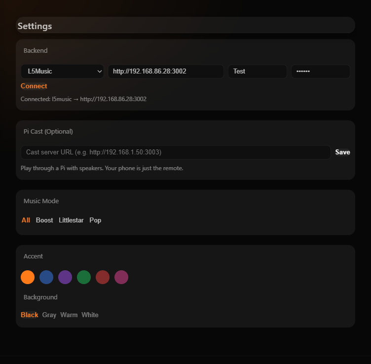
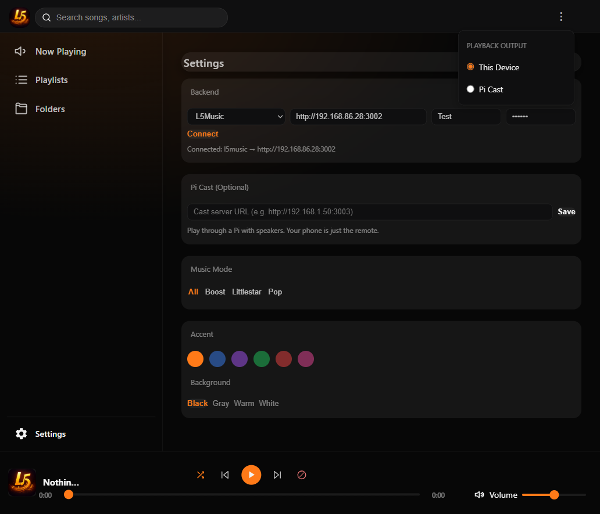

# L5Music Player — Home Assistant Add-on

A universal music streaming PWA that runs as a Home Assistant add-on. Works with Navidrome, Subsonic, Airsonic, Gonic, or L5Music.

**Install the add-on, open it, enter your music server URL, and play.**

## Install

1. In Home Assistant, go to **Settings → Add-ons → Add-on Store**
2. Click **⋮** (top right) → **Repositories**
3. Paste: `https://github.com/L5Diy/ha-l5music-player`
4. Click **Add** → Close
5. Find **L5Music Player** in the store → **Install**
6. Start the add-on → **Open Web UI**

## Setup

1. Go to **Settings** (in the player)
2. Select backend: **L5Music** or **Subsonic / Navidrome**
3. Enter your server URL, username, and password
4. Tap **Connect**
5. Play music



## Features

- **Universal backend** — works with any Subsonic-compatible server
- **Browser playback** — audio plays through your device
- **Pi Cast (optional)** — play through a Pi's speakers, phone/dashboard becomes a remote
- **Mobile + Desktop** — responsive PWA
- **Dynamic music folders** — auto-detects from your library
- **Playlists** — create, edit, reorder, delete
- **Shuffle, block, search** — full player controls
- **Theme customization** — accent colors + backgrounds

## Architecture

```
Home Assistant
  └── L5Music Player Add-on (Docker)
        └── nginx → serves PWA on port 8099
              └── Frontend (adapter.js + app.js)
                    ├── L5Music API ──→ your L5Music server
                    └── Subsonic API ──→ your Navidrome / Airsonic / Gonic
```

The add-on is a lightweight Docker container running nginx. It serves static HTML/JS files. The frontend talks directly to your music server from the browser — no proxy, no middleware.

> **This add-on does not affect your music server.** It is a standalone web player that connects to your existing Navidrome, Subsonic, or L5Music server. Installing, updating, or removing the add-on has zero impact on your music library, playlists, or server configuration.

## Pi Cast (Optional)

**The problem:** When you play music in a browser, audio comes from your phone or dashboard. Your device is tied up — you can't watch videos, take calls, or use other apps without interrupting the music.

**The solution:** Pi Cast lets you play music through a Raspberry Pi's speakers. Your phone or dashboard becomes just a remote control. Pick songs, control playback, then put your device away. The Pi keeps playing independently.

### How it works

1. A small Node.js server (`server.js`, 162 lines) runs on the Pi
2. It spawns mpv (a media player) in idle mode
3. When you select "Pi Cast" in the app, playback commands go to the Pi instead of your browser
4. The Pi fetches the audio stream from your music server and plays it through its speakers
5. You can close the browser, switch apps — music keeps playing from the Pi

### Setup Pi Cast

**On the Pi:**

```bash
curl -sSL https://raw.githubusercontent.com/L5Diy/ha-l5music-player/main/setup-picast.sh | bash
```

This installs Node.js, mpv, and the cast server. It starts automatically via PM2 on port 3003.

**In the app:**

1. Go to **Settings → Pi Cast (Optional)**
2. Enter the Pi's URL: `http://<pi-ip>:3003`
3. Tap **Save**
4. Tap the **⋮** menu in the top bar → select **Pi Cast**
5. Play a song — audio comes from the Pi's speakers



To switch back, tap **⋮** → select **This Device**. The switch is seamless — no page reload, your queue and position are preserved.

### What Pi Cast supports

| Control | How |
|---------|-----|
| Play / Pause | Tap play/pause in the app |
| Skip / Previous | Tap next/prev in the app |
| Seek | Drag the progress bar |
| Volume | Adjust the volume slider |
| Queue | Full queue management, same as browser mode |

### Pi audio output

The Pi plays audio through whatever output is active — 3.5mm jack, HDMI, USB DAC, or a Bluetooth speaker paired to the Pi. Configure your Pi's audio output separately using `pavucontrol`, PipeWire settings, or `bluetoothctl`.

## Compatible Backends

- **[Navidrome](https://www.navidrome.org/)** — lightweight, open-source music server with Subsonic API
- **[L5Music](https://github.com/L5Diy/L5Music)** — self-hosted music streaming for Raspberry Pi
- **[Airsonic](https://airsonic.github.io/)** — community-driven media server
- **[Gonic](https://github.com/sentriz/gonic)** — fast, lightweight Subsonic server
- Any server implementing the [Subsonic API](http://www.subsonic.org/pages/api.jsp)

## Credits

- **[L5Music](https://github.com/L5Diy/L5Music)** — frontend derived from the L5Music PWA
- **[mpv](https://mpv.io/)** (GPL) — media player used in Pi Cast
- **[Express.js](https://expressjs.com/)** (MIT) — HTTP server for Pi Cast

## License

MIT
